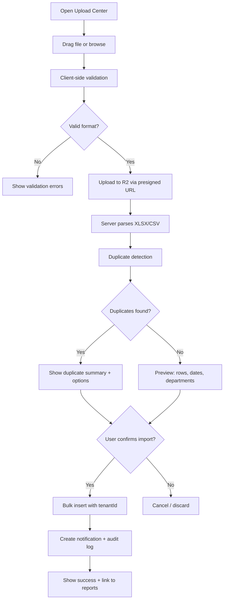
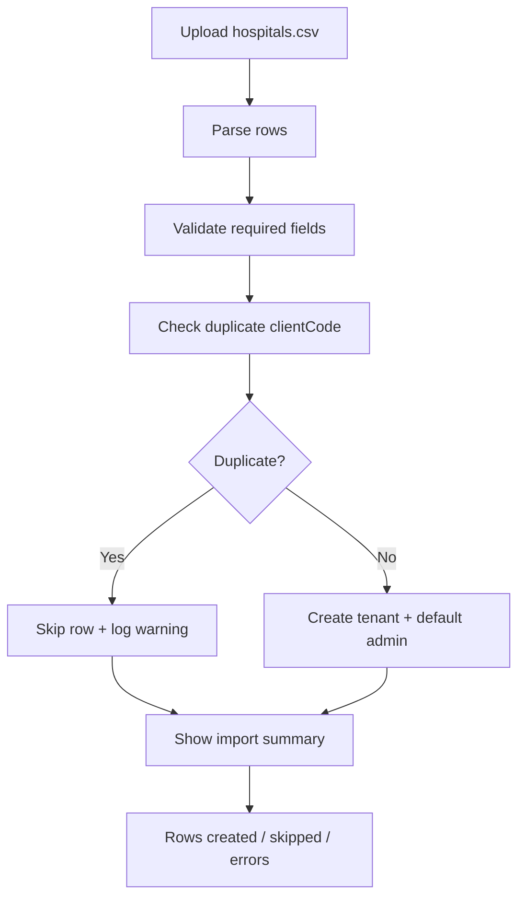
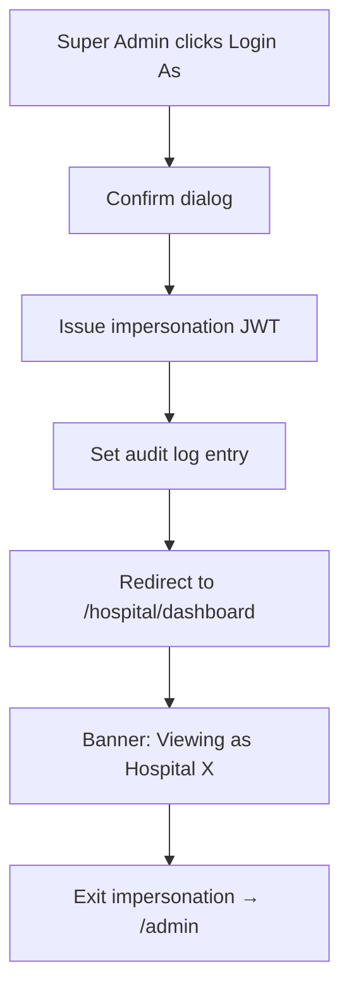

# Excel HMS Analytics — Product Architecture & Design System

**Platform:** Multi-Tenant Hospital Analytics & Reporting Portal  
**Company:** Excel Technologies And Services  
**Version:** 1.0.0  
**Stack:** Next.js 16 · TypeScript · MongoDB Atlas · Cloudflare R2 · JWT

---

## Executive Summary

Excel HMS Analytics transforms daily Excel/CSV hospital reports into a centralized, Stripe-grade analytics experience. Excel Technologies acts as **Super Admin**; each hospital is an isolated **tenant** with Admin and User roles. The platform is designed to scale from 150 hospitals today to 1,000+ with millions of records.

**Product codename:** `InsightHMS`  
**Public URL pattern:** `analytics.exceltechnologies.in` (recommended)

---

## 1. Information Architecture

### 1.1 Public Zone

```
/                           Landing Page (marketing)
/login                      Hospital Login (tenant selector + role + credentials)
/admin/login                Super Admin Login
/forgot-password            Password recovery
/reset-password/[token]     Password reset
/setup-password/[token]       First-time password setup
```

### 1.2 Super Admin Portal (`/admin`)

```
/admin
├── /dashboard              Platform overview widgets
├── /hospitals              CRUD + bulk CSV import
│   └── /[hospitalId]       Hospital detail & impersonation
├── /clients                Client/subscription management
├── /audit-logs             Security & compliance audit trail
├── /activity               Upload & platform activity feed
├── /analytics              Cross-tenant platform metrics
├── /storage                R2 usage by tenant
└── /settings               Platform configuration
```

### 1.3 Hospital Portal (`/hospital`)

```
/hospital
├── /dashboard              KPI cards + quick insights
├── /analytics              Full chart suite (10 visualizations)
├── /upload                 Drag-drop upload center
├── /reports                TanStack data table + exports
├── /snapshots              Executive snapshot builder
├── /users                  User management (Admin only)
├── /notifications          Notification center
├── /settings               Hospital config (Admin only)
└── /ai-insights            Reserved AI module (Admin only)
```

### 1.4 API Routes (`/api/v1`)

```
/api/v1/auth/*              Login, logout, refresh, password flows
/api/v1/admin/*             Super admin operations
/api/v1/hospitals/*         Tenant CRUD, bulk import
/api/v1/uploads/*           File upload, validation, import
/api/v1/analytics/*         Aggregated metrics (tenant-scoped)
/api/v1/reports/*           Report records CRUD + export
/api/v1/users/*             User management
/api/v1/notifications/*     Notification CRUD
/api/v1/snapshots/*         PDF generation + share
/api/v1/storage/*           R2 presigned URLs
```

### 1.5 Navigation Hierarchy

| Role | Primary Nav | Secondary |
|------|---------------|-----------|
| Super Admin | Dashboard, Hospitals, Clients, Activity, Audit, Settings | Profile, Logout |
| Hospital Admin | Dashboard, Analytics, Upload, Reports, Snapshots, Users, Settings | Notifications, AI Insights |
| Hospital User | Dashboard, Upload, Reports | Notifications, Profile |

---

## 2. User Flows

### 2.1 Hospital Login Flow

```mermaid
flowchart TD
    A[Visit /login] --> B[Select Hospital from dropdown]
    B --> C[Select Role: Admin or User]
    C --> D[Enter User ID + Password]
    D --> E{Valid credentials?}
    E -->|No| F[Show error + retry]
    F --> D
    E -->|Yes| G{First login?}
    G -->|Yes| H[/setup-password]
    G -->|No| I{Tenant suspended?}
    I -->|Yes| J[Show suspension message]
    I -->|No| K[Set JWT HttpOnly cookie]
    K --> L[Redirect to /hospital/dashboard]
```

### 2.2 Upload & Import Flow



### 2.3 Super Admin — Bulk Hospital Import



### 2.4 Login As Hospital (Impersonation)



---

## 3. Database Schema (MongoDB)

### 3.1 Collections Overview

| Collection | Purpose | Tenant Scoped |
|------------|---------|---------------|
| `tenants` | Hospital organizations | No |
| `users` | All platform users | Yes (except super admin) |
| `uploads` | File upload metadata | Yes |
| `report_records` | Parsed report row data | Yes |
| `analytics_snapshots` | Pre-aggregated metrics | Yes |
| `audit_logs` | Security audit trail | Platform-wide |
| `activity_logs` | User activity feed | Yes |
| `notifications` | In-app notifications | Yes |
| `subscriptions` | Billing/subscription data | Yes |
| `snapshots` | Generated PDF snapshots | Yes |
| `password_reset_tokens` | Reset token store | No |
| `sessions` | Optional session tracking | No |

### 3.2 Schema Definitions

#### `tenants`

```typescript
{
  _id: ObjectId,
  name: string,                    // "City Hospital Kolkata"
  clientCode: string,              // unique, indexed — "CH-KOL-001"
  contactPerson: string,
  phone: string,
  email: string,
  address: {
    line1: string,
    city: string,
    state: string,
    pincode: string,
    country: string                 // default "India"
  },
  status: "active" | "suspended" | "pending",
  logoUrl?: string,                 // R2 URL
  storageUsedBytes: number,
  storageLimitBytes: number,        // default 5GB
  lastUploadAt?: Date,
  subscriptionId?: ObjectId,
  settings: {
    timezone: string,               // "Asia/Kolkata"
    currency: string,               // "INR"
    alertThresholds: object
  },
  createdAt: Date,
  updatedAt: Date
}
// Indexes: { clientCode: 1 } unique, { status: 1 }, { name: "text" }
```

#### `users`

```typescript
{
  _id: ObjectId,
  tenantId?: ObjectId,              // null for SUPER_ADMIN
  userId: string,                   // login identifier (not email for hospital users)
  email?: string,
  phone?: string,
  name: string,
  passwordHash: string,
  role: "SUPER_ADMIN" | "HOSPITAL_ADMIN" | "HOSPITAL_USER",
  status: "active" | "disabled" | "pending_setup",
  mustChangePassword: boolean,
  lastLoginAt?: Date,
  failedLoginAttempts: number,
  lockedUntil?: Date,
  createdBy?: ObjectId,
  createdAt: Date,
  updatedAt: Date
}
// Indexes: { tenantId: 1, userId: 1 } unique (sparse for super admin)
//          { tenantId: 1, email: 1 }, { role: 1 }
```

#### `uploads`

```typescript
{
  _id: ObjectId,
  tenantId: ObjectId,
  uploadedBy: ObjectId,
  fileName: string,
  fileType: "xlsx" | "csv",
  fileSizeBytes: number,
  r2Key: string,
  r2Url: string,
  status: "pending" | "validating" | "validated" | "importing" | "completed" | "failed",
  validation: {
    rowCount: number,
    dateRangeStart?: Date,
    dateRangeEnd?: Date,
    departments: string[],
    errors: string[],
    warnings: string[],
    duplicateCount: number
  },
  importStats?: {
    inserted: number,
    skipped: number,
    updated: number
  },
  createdAt: Date,
  completedAt?: Date
}
// Indexes: { tenantId: 1, createdAt: -1 }, { status: 1 }
```

#### `report_records`

```typescript
{
  _id: ObjectId,
  tenantId: ObjectId,               // REQUIRED on every query
  uploadId: ObjectId,
  reportDate: Date,
  patientId?: string,
  patientName?: string,
  age?: number,
  gender?: "M" | "F" | "O",
  department: string,
  doctor?: string,
  admissionDate?: Date,
  dischargeDate?: Date,
  revenue?: number,
  pendingBill?: number,
  caseType?: string,
  status?: string,
  metadata: Record<string, unknown>, // flexible HMS fields
  contentHash: string,              // duplicate detection
  createdAt: Date
}
// Indexes: { tenantId: 1, reportDate: -1 }
//          { tenantId: 1, department: 1, reportDate: -1 }
//          { tenantId: 1, contentHash: 1 } unique
//          Compound for analytics aggregations
```

#### `audit_logs`

```typescript
{
  _id: ObjectId,
  actorId: ObjectId,
  actorRole: string,
  tenantId?: ObjectId,
  action: string,                   // "HOSPITAL_CREATED", "LOGIN", "IMPERSONATE"
  resource: string,
  resourceId?: string,
  metadata: object,
  ipAddress: string,
  userAgent: string,
  createdAt: Date
}
// TTL optional: 2 years retention
// Index: { createdAt: -1 }, { tenantId: 1, createdAt: -1 }
```

#### `notifications`

```typescript
{
  _id: ObjectId,
  tenantId: ObjectId,
  userId: ObjectId,
  type: "upload_success" | "upload_failed" | "user_added" | "storage_warning" | "daily_summary",
  title: string,
  message: string,
  read: boolean,
  link?: string,
  createdAt: Date
}
```

#### `snapshots`

```typescript
{
  _id: ObjectId,
  tenantId: ObjectId,
  createdBy: ObjectId,
  filters: {
    dateRange: { start: Date, end: Date },
    departments: string[],
    doctors: string[],
    metrics: string[]
  },
  pdfR2Key: string,
  generatedAt: Date
}
```

---

## 4. Multi-Tenant Architecture

### 4.1 Isolation Model: **Shared Database, Shared Collections**

Every tenant-scoped document includes `tenantId`. All queries enforce tenant filtering at the middleware/repository layer — never in UI alone.

```
┌─────────────────────────────────────────────────────────┐
│                    Next.js Application                   │
├─────────────────────────────────────────────────────────┤
│  Middleware → JWT decode → inject tenantId + role        │
├─────────────────────────────────────────────────────────┤
│  Repository Layer → enforceTenantScope(query, tenantId)  │
├─────────────────────────────────────────────────────────┤
│  MongoDB Atlas (single cluster, indexed tenantId)        │
├─────────────────────────────────────────────────────────┤
│  Cloudflare R2 (prefix: tenants/{tenantId}/uploads/)     │
└─────────────────────────────────────────────────────────┘
```

### 4.2 Tenant Context Flow

1. **Hospital login:** JWT payload `{ sub, role, tenantId, tenantName }`
2. **Super Admin:** JWT payload `{ sub, role: SUPER_ADMIN }` — no tenantId
3. **Impersonation:** JWT payload adds `impersonating: { tenantId, adminId }`
4. **API middleware:** Extract context → reject cross-tenant access with 403

### 4.3 R2 Storage Structure

```
excel-analytics/
├── tenants/{tenantId}/uploads/{uploadId}/{filename}
├── tenants/{tenantId}/snapshots/{snapshotId}.pdf
├── tenants/{tenantId}/assets/logo.png
└── platform/exports/{exportId}.xlsx
```

### 4.4 Scalability Strategy

| Layer | Strategy |
|-------|----------|
| Database | Compound indexes on `(tenantId, reportDate)`; read replicas |
| Analytics | Pre-aggregated `analytics_snapshots` via background jobs |
| Uploads | Async import queue (future: BullMQ / Inngest) |
| Caching | Redis for dashboard KPIs (future phase) |
| Sharding | Shard key `tenantId` when > 500 tenants |

---

## 5. RBAC Design

### 5.1 Roles

| Role | Scope | tenantId |
|------|-------|----------|
| `SUPER_ADMIN` | Entire platform | null |
| `HOSPITAL_ADMIN` | Single hospital | required |
| `HOSPITAL_USER` | Single hospital (limited) | required |

### 5.2 Permission Matrix

| Permission | Super Admin | Hospital Admin | Hospital User |
|------------|:-----------:|:--------------:|:-------------:|
| Manage hospitals | ✅ | ❌ | ❌ |
| Bulk import hospitals | ✅ | ❌ | ❌ |
| Suspend/delete hospital | ✅ | ❌ | ❌ |
| Login as hospital | ✅ | ❌ | ❌ |
| View platform analytics | ✅ | ❌ | ❌ |
| View audit logs | ✅ | ❌ | ❌ |
| Manage hospital users | ✅ | ✅ | ❌ |
| Upload reports | ✅* | ✅ | ✅ |
| View all analytics | ✅* | ✅ | ⚠️ Limited |
| Export reports | ✅* | ✅ | ⚠️ View only |
| Snapshot builder | ✅* | ✅ | ❌ |
| Hospital settings | ✅* | ✅ | ❌ |
| AI insights | ✅* | ✅ | ❌ |
| Change own password | ✅ | ✅ | ✅ |

*When impersonating or acting on behalf of tenant.

### 5.3 Route Guards

```typescript
// middleware.ts route protection
/admin/*          → SUPER_ADMIN only
/hospital/users   → HOSPITAL_ADMIN, SUPER_ADMIN (impersonating)
/hospital/settings → HOSPITAL_ADMIN
/hospital/analytics → HOSPITAL_ADMIN (full), HOSPITAL_USER (basic charts)
/hospital/ai-insights → HOSPITAL_ADMIN only
```

---

## 6. Dashboard Wireframes

### 6.1 Super Admin Dashboard

```
┌──────────────────────────────────────────────────────────────────┐
│ [Logo] Excel Admin          🔍 Search    🔔 Notifications  [Avatar]│
├──────────┬───────────────────────────────────────────────────────┤
│ Dashboard│  Good morning, Ranjit                                    │
│ Hospitals│  ┌─────────┐ ┌─────────┐ ┌─────────┐ ┌─────────┐      │
│ Clients  │  │ 152     │ │ 148     │ │ 1,240   │ │ 847     │      │
│ Activity │  │Hospitals│ │ Active  │ │ Users   │ │Uploads  │      │
│ Audit    │  └─────────┘ └─────────┘ └─────────┘ └─────────┘      │
│ Storage  │  ┌─────────────────────────┐ ┌─────────────────────┐  │
│ Settings │  │ Upload Activity (7d)    │ │ Storage by Tenant   │  │
│          │  │ [Area Chart]            │ │ [Horizontal Bar]    │  │
│          │  └─────────────────────────┘ └─────────────────────┘  │
│          │  Recent Hospitals                    Quick Actions     │
│          │  [Table: name, status, last upload]  [+ Add Hospital]  │
└──────────┴───────────────────────────────────────────────────────┘
```

### 6.2 Hospital Dashboard

```
┌──────────────────────────────────────────────────────────────────┐
│ [Hospital Logo] City Hospital    📅 Last 7 Days ▼   🔔  [Avatar]  │
├──────────┬───────────────────────────────────────────────────────┤
│ Dashboard│  ┌──────┐ ┌──────┐ ┌──────┐ ┌──────┐ ┌──────┐ ┌──────┐│
│ Analytics│  │2,847 │ │ 412  │ │ 389  │ │₹18.4L│ │ ₹2.1L│ │  23  ││
│ Upload   │  │Patient│ │Admit │ │Disch │ │Revenue│ │Pending│ │Crit ││
│ Reports  │  │ ↑12% │ │ ↑8%  │ │ ↓3%  │ │ ↑18% │ │ ↓5%  │ │ ↑2  ││
│ Snapshots│  └──────┘ └──────┘ └──────┘ └──────┘ └──────┘ └──────┘│
│ Users    │  ┌──────────────────────┐ ┌────────────────────────┐ │
│ Settings │  │ Patient Trend        │ │ Revenue Trend            │ │
│          │  │ [Line Chart]         │ │ [Area Chart]             │ │
│          │  └──────────────────────┘ └────────────────────────┘ │
│          │  🤖 AI Insights (Coming Soon)                         │
│          │  "Admissions increased 14% this week"                 │
└──────────┴───────────────────────────────────────────────────────┘
```

### 6.3 Upload Center

```
┌──────────────────────────────────────────────────────────────────┐
│ Upload Center                                                     │
├──────────────────────────────────────────────────────────────────┤
│  ┌ ─ ─ ─ ─ ─ ─ ─ ─ ─ ─ ─ ─ ─ ─ ─ ─ ─ ─ ─ ─ ─ ─ ─ ─ ─ ─ ─ ─ ┐  │
│  │         📁 Drag & drop Excel or CSV files here              │  │
│  │              or click to browse (max 50MB)                  │  │
│  └ ─ ─ ─ ─ ─ ─ ─ ─ ─ ─ ─ ─ ─ ─ ─ ─ ─ ─ ─ ─ ─ ─ ─ ─ ─ ─ ─ ─ ┘  │
│                                                                   │
│  Upload History                                                   │
│  ┌────────────────────────────────────────────────────────────┐  │
│  │ File          │ Rows  │ Date Range    │ Status   │ Action  │  │
│  │ report_jan.xlsx│ 1,240│ Jan 1-31      │ ✅ Done  │ View    │  │
│  └────────────────────────────────────────────────────────────┘  │
└──────────────────────────────────────────────────────────────────┘
```

---

## 7. Mobile Responsive Layouts

### Breakpoints

| Token | Width | Layout |
|-------|-------|--------|
| `sm` | 640px | Single column, bottom nav |
| `md` | 768px | Collapsible sidebar |
| `lg` | 1024px | Full sidebar + content |
| `xl` | 1280px | Dashboard grid 3-col |
| `2xl` | 1536px | Max-width container 1440px |

### Mobile Patterns

- **Navigation:** Bottom tab bar (Dashboard, Upload, Reports, More)
- **Sidebar → Sheet:** Hamburger opens slide-over nav
- **KPI Cards:** Horizontal scroll snap on mobile
- **Charts:** Full-width, reduced height (240px)
- **Data Tables:** Card view on mobile, table on desktop
- **Upload:** Full-screen drop zone with camera/file picker

---

## 8. Component Structure

```
src/components/
├── ui/                     # shadcn primitives
├── layout/
│   ├── app-shell.tsx       # Main layout wrapper
│   ├── admin-sidebar.tsx
│   ├── hospital-sidebar.tsx
│   ├── top-bar.tsx
│   ├── mobile-nav.tsx
│   └── impersonation-banner.tsx
├── auth/
│   ├── hospital-login-form.tsx
│   ├── admin-login-form.tsx
│   └── password-strength.tsx
├── dashboard/
│   ├── kpi-card.tsx
│   ├── trend-badge.tsx
│   ├── stat-grid.tsx
│   └── empty-state.tsx
├── analytics/
│   ├── date-range-filter.tsx
│   ├── patient-trend-chart.tsx
│   ├── revenue-area-chart.tsx
│   ├── admissions-chart.tsx
│   ├── department-bar-chart.tsx
│   ├── gender-donut.tsx
│   ├── age-group-chart.tsx
│   ├── peak-hours-heatmap.tsx
│   ├── doctor-leaderboard.tsx
│   ├── revenue-by-dept.tsx
│   └── patient-funnel.tsx
├── upload/
│   ├── drop-zone.tsx
│   ├── upload-progress.tsx
│   ├── validation-summary.tsx
│   └── upload-history-table.tsx
├── reports/
│   ├── reports-data-table.tsx
│   ├── column-toggle.tsx
│   └── export-menu.tsx
├── snapshots/
│   ├── snapshot-builder-form.tsx
│   └── snapshot-preview.tsx
├── users/
│   ├── user-form-dialog.tsx
│   └── users-data-table.tsx
├── hospitals/
│   ├── hospital-form-dialog.tsx
│   ├── hospitals-data-table.tsx
│   └── bulk-import-dialog.tsx
├── notifications/
│   └── notification-center.tsx
├── ai/
│   └── ai-insights-panel.tsx    # Reserved placeholder
└── marketing/
    ├── hero-section.tsx
    ├── features-grid.tsx
    ├── social-proof.tsx
    ├── pricing-section.tsx
    └── cta-section.tsx
```

---

## 9. Folder Structure (Next.js 16)

```
etechsoftsol/
├── docs/
│   └── PRODUCT_ARCHITECTURE.md
├── public/
│   ├── logos/
│   └── og-image.png
├── src/
│   ├── app/
│   │   ├── (marketing)/
│   │   │   ├── layout.tsx
│   │   │   └── page.tsx                 # Landing page
│   │   ├── (auth)/
│   │   │   ├── layout.tsx
│   │   │   ├── login/page.tsx
│   │   │   ├── admin/login/page.tsx
│   │   │   ├── forgot-password/page.tsx
│   │   │   ├── reset-password/[token]/page.tsx
│   │   │   └── setup-password/[token]/page.tsx
│   │   ├── admin/
│   │   │   ├── layout.tsx
│   │   │   ├── dashboard/page.tsx
│   │   │   ├── hospitals/page.tsx
│   │   │   ├── clients/page.tsx
│   │   │   ├── audit-logs/page.tsx
│   │   │   ├── activity/page.tsx
│   │   │   └── settings/page.tsx
│   │   ├── hospital/
│   │   │   ├── layout.tsx
│   │   │   ├── dashboard/page.tsx
│   │   │   ├── analytics/page.tsx
│   │   │   ├── upload/page.tsx
│   │   │   ├── reports/page.tsx
│   │   │   ├── snapshots/page.tsx
│   │   │   ├── users/page.tsx
│   │   │   ├── notifications/page.tsx
│   │   │   ├── settings/page.tsx
│   │   │   └── ai-insights/page.tsx
│   │   ├── api/v1/
│   │   │   ├── auth/
│   │   │   ├── admin/
│   │   │   ├── hospitals/
│   │   │   ├── uploads/
│   │   │   ├── analytics/
│   │   │   ├── reports/
│   │   │   ├── users/
│   │   │   ├── notifications/
│   │   │   └── snapshots/
│   │   ├── globals.css
│   │   └── layout.tsx
│   ├── components/           # See Section 8
│   ├── lib/
│   │   ├── db/
│   │   │   ├── connect.ts
│   │   │   └── tenant-scope.ts
│   │   ├── auth/
│   │   │   ├── jwt.ts
│   │   │   ├── password.ts
│   │   │   └── session.ts
│   │   ├── rbac/
│   │   │   ├── permissions.ts
│   │   │   └── guards.ts
│   │   ├── storage/
│   │   │   └── r2.ts
│   │   ├── parsers/
│   │   │   ├── excel.ts
│   │   │   └── csv.ts
│   │   └── utils.ts
│   ├── models/               # Mongoose schemas
│   ├── hooks/
│   ├── types/
│   └── middleware.ts
├── .env.example
├── components.json
├── next.config.ts
├── package.json
└── tsconfig.json
```

---

## 10. shadcn/ui Components Mapping

| Feature | shadcn Components |
|---------|-------------------|
| KPI Cards | `Card`, `Badge` |
| Sidebar Nav | `Sheet` (mobile), custom sidebar |
| Data Tables | `Table`, `DropdownMenu`, `Checkbox`, `Input` |
| Forms | `Input`, `Label`, `Select`, `Textarea`, `Switch`, `Button` |
| Dialogs | `Dialog`, `AlertDialog` |
| Upload | `Progress`, custom drop zone |
| Charts | `Chart` (Recharts wrapper) |
| Filters | `Popover`, `Select`, `Calendar` |
| Notifications | `Sonner` (toast), `ScrollArea` |
| User Menu | `DropdownMenu`, `Avatar` |
| Tabs | `Tabs` for analytics sections |
| Loading | `Skeleton` |
| Tooltips | `Tooltip` |
| Command Palette | `Command` (future) |
| Alerts | `Alert` for validation errors |

---

## 11. UI/UX Strategy

### Principles

1. **Data first** — Charts and KPIs above the fold; minimal chrome
2. **Progressive disclosure** — Simple default views; advanced filters on demand
3. **Trust through clarity** — Validation summaries before import; audit trails visible
4. **Speed perception** — Skeleton loaders, optimistic UI, instant filter feedback
5. **Familiar SaaS patterns** — Stripe-like sidebar, Vercel-like typography, Linear-like density

### Key UX Decisions

| Decision | Rationale |
|----------|-----------|
| Hospital dropdown on login | Users may work at multiple locations; no signup needed |
| Role selector on login | Single login page; reduces confusion |
| No self-signup | Enterprise B2B; hospitals provisioned by Excel Technologies |
| Import preview before commit | Prevents bad data; builds trust |
| Impersonation banner | Clear audit trail when super admin views as hospital |
| Reserved AI section | Future-ready without empty promises — "Coming Soon" with architecture |

### Empty States

Every list/table has designed empty states with:
- Illustration or icon
- Clear headline ("No reports uploaded yet")
- Primary CTA ("Upload your first report")
- Secondary help link

### Error States

- Inline field errors on forms
- Toast for async failures
- Full-page error for 403/404 with recovery actions

---

## 12. Design System

### Spacing Scale (4px base)

| Token | Value | Usage |
|-------|-------|-------|
| `space-1` | 4px | Tight inline |
| `space-2` | 8px | Icon gaps |
| `space-3` | 12px | Form field padding |
| `space-4` | 16px | Card padding mobile |
| `space-6` | 24px | Card padding desktop |
| `space-8` | 32px | Section gaps |
| `space-12` | 48px | Page sections |
| `space-16` | 64px | Marketing sections |

### Border Radius

| Token | Value |
|-------|-------|
| `--radius-sm` | 6px |
| `--radius-md` | 8px |
| `--radius-lg` | 10px (default) |
| `--radius-xl` | 14px |
| `--radius-2xl` | 18px |

### Shadows

```css
--shadow-soft: 0 1px 3px oklch(0 0 0 / 0.04), 0 4px 12px oklch(0 0 0 / 0.03);
--shadow-card: 0 1px 2px oklch(0 0 0 / 0.05), 0 8px 24px oklch(0 0 0 / 0.06);
--shadow-elevated: 0 4px 6px oklch(0 0 0 / 0.05), 0 20px 40px oklch(0 0 0 / 0.08);
```

### Glass Effect

```css
.glass {
  background: oklch(1 0 0 / 0.72);
  backdrop-filter: blur(12px);
  border: 1px solid oklch(1 0 0 / 0.2);
}
```

---

## 13. Color Palette

### Brand Colors

| Name | Light Mode | Dark Mode | Usage |
|------|------------|-----------|-------|
| **Primary** | `oklch(0.45 0.14 195)` Teal | `oklch(0.65 0.14 195)` | CTAs, links, active nav |
| **Primary Foreground** | White | `oklch(0.15 0.02 195)` | Text on primary |
| **Accent** | `oklch(0.55 0.2 260)` Blue | `oklch(0.7 0.18 260)` | Charts, highlights |
| **Success** | `oklch(0.62 0.17 155)` | Same | Positive trends |
| **Warning** | `oklch(0.75 0.15 85)` | Same | Storage warnings |
| **Destructive** | `oklch(0.577 0.245 27)` | Same | Errors, suspend |

### Neutral Scale

| Token | Light | Usage |
|-------|-------|-------|
| Background | `oklch(0.99 0.002 240)` | Page bg — slight cool tint |
| Foreground | `oklch(0.18 0.02 240)` | Body text |
| Muted | `oklch(0.96 0.005 240)` | Subtle backgrounds |
| Muted Foreground | `oklch(0.5 0.02 240)` | Secondary text |
| Border | `oklch(0.91 0.005 240)` | Dividers |

### Chart Palette

```
--chart-1: Teal     (primary metric)
--chart-2: Blue     (secondary)
--chart-3: Violet   (tertiary)
--chart-4: Amber    (comparison)
--chart-5: Rose     (alert/highlight)
```

---

## 14. Typography System

### Font Stack

| Role | Font | Weight |
|------|------|--------|
| **Sans (UI)** | Geist Sans | 400, 500, 600, 700 |
| **Mono (data)** | Geist Mono | 400, 500 |
| **Display (marketing)** | Geist Sans | 600, 700 |

### Type Scale

| Name | Size | Line Height | Usage |
|------|------|-------------|-------|
| `display-2xl` | 48px | 1.1 | Hero headline |
| `display-xl` | 36px | 1.15 | Section titles |
| `heading-lg` | 24px | 1.3 | Page titles |
| `heading-md` | 20px | 1.4 | Card titles |
| `heading-sm` | 16px | 1.5 | Subsections |
| `body-lg` | 16px | 1.6 | Marketing body |
| `body-md` | 14px | 1.5 | Default UI |
| `body-sm` | 13px | 1.45 | Table cells |
| `caption` | 12px | 1.4 | Labels, badges |
| `mono-stat` | 28px | 1.2 | KPI numbers |

---

## 15. Dashboard Layout Specifications

### Grid System

```css
.dashboard-grid {
  display: grid;
  gap: 1.5rem;
  grid-template-columns: repeat(12, 1fr);
}
.kpi-row { grid-column: span 12; display: grid; grid-template-columns: repeat(auto-fit, minmax(180px, 1fr)); gap: 1rem; }
.chart-main { grid-column: span 12; @media (lg) { grid-column: span 8; } }
.chart-side { grid-column: span 12; @media (lg) { grid-column: span 4; } }
```

### Sidebar

- Width: 256px (desktop), 72px collapsed (optional future)
- Background: `--sidebar`
- Active item: primary tint background + left border accent
- Logo area: 64px height

### Top Bar

- Height: 56px
- Sticky, glass effect on scroll
- Contains: breadcrumb, date filter, search (admin), notifications bell, avatar menu

### Content Area

- Max width: 1440px centered
- Padding: 24px (desktop), 16px (mobile)
- Background: subtle gradient or muted pattern

---

## 16. Animation Specifications

Using **Motion** (Framer Motion successor):

### Page Transitions

```typescript
const pageVariants = {
  initial: { opacity: 0, y: 8 },
  animate: { opacity: 1, y: 0, transition: { duration: 0.3, ease: [0.25, 0.1, 0.25, 1] } },
  exit: { opacity: 0, y: -4, transition: { duration: 0.2 } }
};
```

### Micro-interactions

| Element | Animation |
|---------|-----------|
| KPI cards | Stagger fade-up, 50ms delay each |
| Buttons | Scale 0.98 on press |
| Sidebar items | Background fade 150ms |
| Charts | Draw-in on mount (800ms) |
| Upload drop zone | Border pulse when dragging |
| Toast notifications | Slide from top-right |
| Modal/Dialog | Scale 0.95 → 1 + fade |
| Skeleton | Shimmer pulse |

### Performance Rules

- Animate `transform` and `opacity` only
- Respect `prefers-reduced-motion`
- No animation on data table rows > 100 items

---

## 17. Enterprise SaaS Best Practices

### Security

- JWT in HttpOnly, Secure, SameSite=Strict cookies
- Password: bcrypt cost factor 12
- Rate limiting on auth endpoints (5 attempts / 15 min)
- CSRF protection on mutations
- Input validation with Zod on all API routes
- Tenant isolation enforced server-side
- Audit log for all admin actions
- Impersonation time-limited (4 hours)

### Performance

- Server Components for dashboard shells
- Client Components only for interactivity
- Pagination on all list endpoints (default 25)
- Aggregation pipelines for analytics
- Presigned URLs for direct R2 upload (bypass server)
- Image optimization via Next.js Image

### Observability

- Structured logging (JSON)
- Error tracking (Sentry — future)
- Upload/import job status tracking
- Health check endpoint `/api/health`

### Compliance Readiness

- Data residency: MongoDB Atlas Mumbai region
- Audit log retention policy
- User data export capability
- Hospital data deletion workflow
- PII minimization in report_records

### Environment Variables

```env
MONGODB_URI=
JWT_SECRET=
JWT_EXPIRES_IN=7d
R2_ACCOUNT_ID=
R2_ACCESS_KEY_ID=
R2_SECRET_ACCESS_KEY=
R2_BUCKET_NAME=
R2_PUBLIC_URL=
SUPER_ADMIN_EMAIL=excel.rks@gmail.com
SUPER_ADMIN_PASSWORD=          # Set in seed script only
NEXT_PUBLIC_APP_URL=
```

---

## 18. Landing Page — $50M Grade Specification

### Hero Section

**Headline:** "Hospital analytics, finally beautiful."  
**Subheadline:** "Transform daily Excel reports into real-time dashboards. Built for 150+ hospitals across India by Excel Technologies."  
**CTAs:** [Hospital Login] [Request Demo]  
**Visual:** Animated dashboard mockup with floating KPI cards, subtle parallax grid background

### Social Proof Bar

"Trusted by 150+ hospitals across West Bengal and beyond"

Logos: placeholder hospital badges (anonymized)

### Features Grid (3×2)

1. **Instant Analytics** — Upload Excel, see insights in seconds
2. **Multi-Hospital Ready** — Isolated, secure tenant architecture
3. **Executive Snapshots** — PDF reports via email or WhatsApp
4. **Role-Based Access** — Admin, staff, and operator permissions
5. **Enterprise Security** — Audit logs, encryption, compliance-ready
6. **AI Insights** — Coming soon: automated trend detection

### How It Works (3 steps)

1. Export daily report from HMS → 2. Upload to portal → 3. Access dashboards instantly

### Metrics Strip

```
150+ Hospitals  ·  1M+ Records Processed  ·  99.9% Uptime  ·  <30s Import Time
```

### Testimonial

> "We finally have visibility across departments without waiting for manual reports."  
> — Hospital Administrator, Kolkata

### Pricing Teaser

"Flexible plans for single hospitals to hospital chains. Contact Excel Technologies."

### Footer CTA

Dark section with gradient: "Ready to modernize your hospital analytics?"  
[Contact Excel Technologies] → mailto:excel.rks@gmail.com

### Visual Design Notes

- Dark hero with teal gradient orb (Vercel-inspired)
- Light content sections alternating
- Subtle grid/dot pattern backgrounds
- Motion: fade-up on scroll (Intersection Observer)
- Mobile: stacked, full-width CTAs

---

## Appendix A: Default Super Admin Seed

```
Email/User ID: excel.rks@gmail.com
Password: Ranjit@2020 (must be hashed in seed script — change on first login in production)
```

## Appendix B: Hospital Login Form Fields

1. Hospital (searchable select from active tenants)
2. Role (Admin | User)
3. User ID (text)
4. Password (password)
5. [Login] + Forgot Password link

## Appendix C: AI Module Architecture (Future)

```
┌─────────────────┐     ┌──────────────────┐     ┌─────────────────┐
│ analytics_snap  │────▶│ Insight Engine   │────▶│ ai_insights     │
│ report_records  │     │ (LLM + rules)    │     │ collection      │
└─────────────────┘     └──────────────────┘     └─────────────────┘
```

Reserved UI: `/hospital/ai-insights` with placeholder cards and API route stub.

---

*Document maintained by Excel Technologies And Services · InsightHMS Platform Team*
